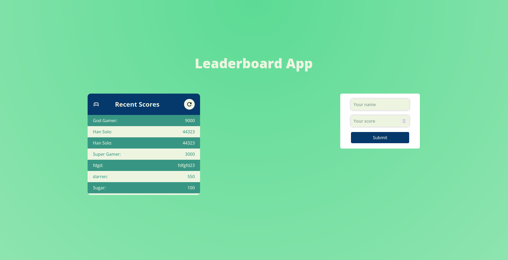

# Leaderboard

> Simple project where the list of players with the highest scores are presented.

This simple app allows you to see the list of gamers with the highest scores in the game.

## Built With

- Major languages
  - HTML/CSS
  - SCSS
  - JavaScript
- Frameworks
  - n/a
- Technologies used
  - webpack
  - gitflow

## Live Demo

[Live Demo Link](https://livedemo.com)

## Getting Started

**This is an example of how you may give instructions on setting up your project locally.**
**Modify this file to match your project, remove sections that don't apply. For example: delete the testing section if the currect project doesn't require testing.**

To get a local copy up and running follow these simple example steps.

### Prerequisites
  - Node.js is to be installed on your machine
  - Basic knowladge of JavaScript, CSS, HTML

### Setup
  - Install npm locally
  - Clone this repo locally usign the below comand:
      git clone https://github.com/Hope1226/To-Do-List.git
  - Install webpack and webpack -cli via follwoing comand:
      npm install webpack webpack -cli --save-dev

### Usage
  - Oly files in src are to be modified
  - Run nmp webpack to bundle the modules

## Authors

👤 **Umidjon Ustabaev (Hope)**

- GitHub: [@githubhandle](https://github.com/githubhandle)
- Twitter: [@twitterhandle](https://twitter.com/twitterhandle)
- LinkedIn: [LinkedIn](https://linkedin.com/in/linkedinhandle)

## 🤝 Contributing

Contributions, issues, and feature requests are welcome!

Feel free to check the [issues page](../../issues/).

## Show your support

Give a ⭐️ if you like this project!

## Acknowledgments

- Hat tip to anyone whose code was used
- Inspiration
- etc

## 📝 License

This project is [MIT](./MIT.md) licensed.
